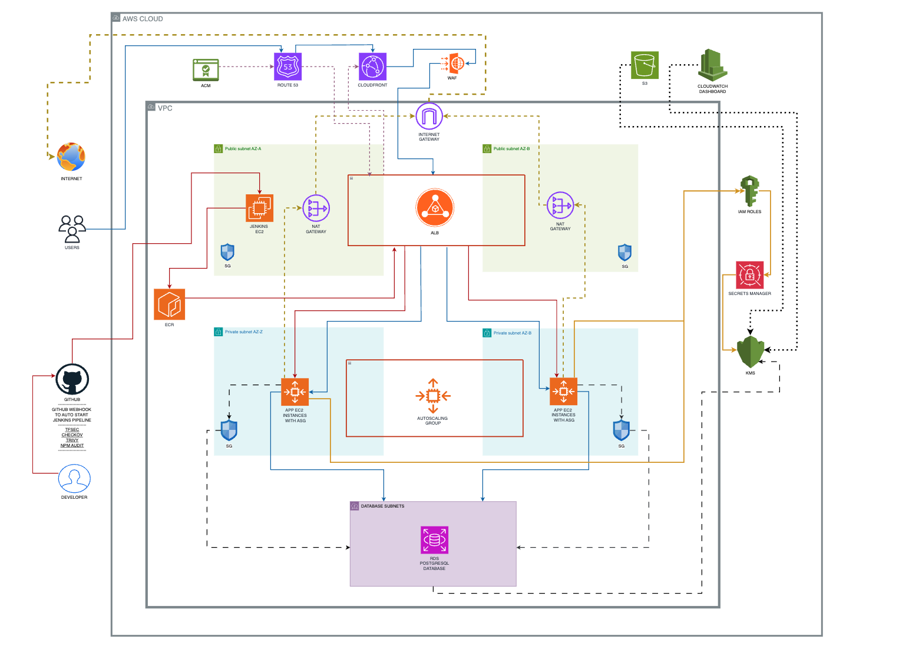

# Jenkins CI/CD Project on AWS

**Tech Stack:** Jenkins, Terraform, Node.js Express, GitHub Webhooks, AWS EC2, RDS PostgreSQL, Bash Scripting

A complete CI/CD pipeline demonstrating enterprise-grade DevSecOps practices with Jenkins automation, comprehensive security scanning, and production-ready AWS infrastructure. This project showcases modern Infrastructure as Code patterns and automated deployment workflows.

**Health Endpoint:** https://dev-api.iasolutions.co.uk/health

## Author

**Alamin Islam**  
LinkedIn: [linkedin.com/in/alamin-islam-58a635300](https://www.linkedin.com/in/alamin-islam-58a635300)  
Portfolio: [github.com/Aislam00](https://github.com/Aislam00)

## What it does

This project demonstrates a complete DevSecOps pipeline that automates code deployment from GitHub to AWS infrastructure through Jenkins. Built to showcase enterprise CI/CD patterns, security scanning integration, and Infrastructure as Code best practices using Terraform.

**Key Features:**
- Automated GitHub webhook integration with Jenkins
- Multi-stage security scanning (tfsec, Checkov, Trivy, npm audit)
- Auto Scaling Group deployment with instance refresh
- Custom domain with HTTPS (dev-api.iasolutions.co.uk)
- Complete Infrastructure as Code with Terraform modules
- Production-ready monitoring and logging

## How to deploy

### Prerequisites
- AWS CLI configured with appropriate permissions
- Terraform >= 1.0
- Jenkins server access
- GitHub repository with webhook configuration

### Clone and Deploy

```bash
# Clone the repository
git clone https://github.com/aislam00/cicd-gothinkster1.git
cd cicd-gothinkster

# Set up Terraform backend
cd terraform/backend
terraform init && terraform apply

# Deploy infrastructure
cd ../environments/dev
terraform init && terraform apply

# Configure Jenkins webhook
# Add webhook URL: http://YOUR_JENKINS_IP:8080/github-webhook/
```

### Health Check

```bash
curl https://dev-api.iasolutions.co.uk/health
# Response: {"status":"ok","timestamp":"...","uptime":...}
```

## Architecture



### Architecture Flow Legend:
- **Blue solid arrows** → User Web Traffic Flow
- **Red solid arrows** → Developer CI/CD Pipeline Flow  
- **Yellow dashed arrows** → Monitoring & Logging Output
- **Black long-dashed arrows** → Database Connections & Application Secrets
- **Black dotted arrows** → KMS Encryption Connections

**Core Components:**
- **Jenkins EC2** - CI/CD orchestration and automation
- **Auto Scaling Group** - Container deployment across multiple AZs
- **Application Load Balancer** - HTTPS termination and traffic distribution
- **RDS PostgreSQL** - Production database with Multi-AZ deployment
- **Route53 + ACM** - Custom domain with auto-renewing SSL certificates
- **ECR** - Private container registry for application images

## Security Features

**Comprehensive Security Scanning:**
- **tfsec** - Terraform static security analysis
- **Checkov** - Infrastructure compliance scanning  
- **Trivy** - Container vulnerability assessment
- **npm audit** - Dependency security validation


**Security Implementation:**
- All application instances in private subnets
- HTTPS enforcement with HTTP→HTTPS redirects
- IAM roles with least privilege access
- Secrets managed through AWS Secrets Manager
- KMS encryption for all sensitive data
- Network segmentation with security groups

## CI/CD Pipeline

**Automated Workflow:**
1. Developer pushes code to GitHub
2. GitHub webhook triggers Jenkins build
3. Jenkins performs security scanning (parallel execution)
4. Docker image build and push to ECR
5. Auto Scaling Group instance refresh deployment
6. Health check validation

### GitHub Webhook Integration


### Successful Pipeline Execution


## Monitoring & Operations

**Observability:**
- CloudWatch dashboards for infrastructure and application metrics
- Auto Scaling Group health monitoring
- Application Load Balancer target health tracking
- Comprehensive logging to CloudWatch Logs
- VPC Flow Logs for network analysis

### CloudWatch Monitoring


## Project Overview

This is a complete end-to-end DevSecOps project demonstrating enterprise-grade CI/CD patterns including automated security scanning, Infrastructure as Code, GitHub webhook integration, and production monitoring. The platform showcases real-world Jenkins operations with scalable, secure AWS architecture patterns suitable for production workloads.

The infrastructure includes 11 Terraform modules and 100+ AWS resources managing everything from VPC networking to secrets management, demonstrating modular design principles and environment separation that would be used in enterprise settings.